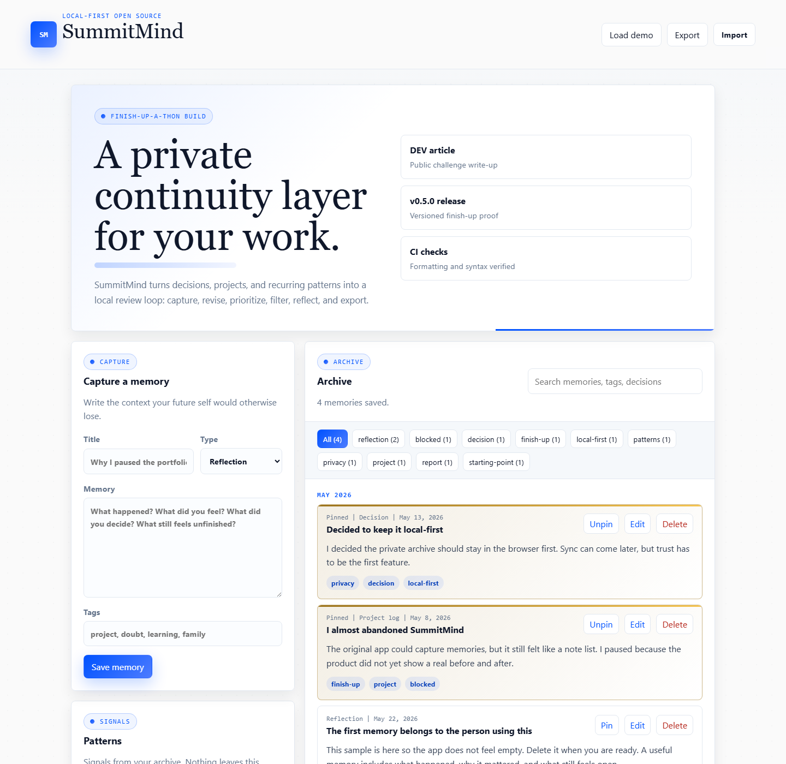

# SummitMind

[](https://github.com/P-r-e-m-i-u-m/SummitMind/actions/workflows/checks.yml)

An open-source, local-first memory app for people who want to understand their own past thoughts, decisions, projects, and patterns.

Most note apps help you store information. SummitMind helps you notice what keeps coming back.

## Quick Links

- Demo view: open `index.html?demo=1&report=1`
- Live demo: <https://p-r-e-m-i-u-m.github.io/SummitMind/?demo=1&report=1>
- DEV article: <https://dev.to/premium_26/summitmind-finishing-a-local-first-memory-app-for-the-github-finish-up-a-thon-5h49>
- Build proof: [docs/BUILD_PROOF.md](docs/BUILD_PROOF.md)
- Judge guide: [docs/JUDGE_GUIDE.md](docs/JUDGE_GUIDE.md)
- Demo report: [docs/DEMO_REPORT.md](docs/DEMO_REPORT.md)
- DEV post draft: [docs/DEV_POST.md](docs/DEV_POST.md)
- Challenge notes: [CHALLENGE_SUBMISSION.md](CHALLENGE_SUBMISSION.md)
- Changelog: [CHANGELOG.md](CHANGELOG.md)

## Finish-Up-A-Thon Revival

SummitMind started as a simple browser note archive and then stalled before it felt like a finished product. This revival turns it into a usable local-first reflection tool with editing, pinning, tag filters, demo data, Markdown reports, print support, and a monthly review flow.

Read the public DEV write-up: [SummitMind: Finishing a Local-First Memory App for the GitHub Finish-Up-A-Thon](https://dev.to/premium_26/summitmind-finishing-a-local-first-memory-app-for-the-github-finish-up-a-thon-5h49).

Review the ownership and publishing proof in [docs/BUILD_PROOF.md](docs/BUILD_PROOF.md).

See [CHALLENGE_SUBMISSION.md](CHALLENGE_SUBMISSION.md) for the before/after story and implementation notes.



## What It Does

- Save memories as notes, decisions, project logs, conversations, or reflections.
- Search across your personal archive.
- Edit memories after saving them.
- Pin important memories above the timeline.
- Filter the archive by recurring tags.
- View your timeline by month.
- Detect repeated themes, unfinished loops, decisions, and emotional patterns.
- Generate a local monthly reflection report.
- Copy the report as Markdown.
- Print a clean archive/report view.
- Export your archive as JSON.
- Import a previous archive.
- Load demo memories to explore the app quickly.
- Run fully in the browser with no account and no server.

## Try It

No install is required.

1. Open the [live demo](https://p-r-e-m-i-u-m.github.io/SummitMind/?demo=1&report=1) or open `index.html` in a browser.
2. Click **Load demo** to see a filled archive.
3. Add or edit a memory.
4. Pin an important memory.
5. Open **Report** to generate a private reflection summary.
6. Use **Copy** to save the report as Markdown, or **Print** for a clean review copy.

For a quick demo view, open `index.html?demo=1&report=1`.

## Development

```bash
npm install
npm run check
```

There is still no build step. The checks only validate formatting and JavaScript syntax.

## Why This Exists

People forget the context behind their own decisions.

You may remember that you stopped a project, changed a goal, or felt stuck, but not the real reason. This app is designed to become a private continuity layer for your mind:

- What was I building last month?
- Why did I pause this idea?
- Which problems keep repeating?
- What decisions did I already make?
- What unfinished work still has energy?

## MVP

This first version is intentionally simple:

- `index.html`
- `styles.css`
- `app.js`
- no backend
- no build step
- no tracking

Open `index.html` in a browser and start writing.

## Challenge Proof

The finished version adds the missing loop that made the project useful:

- capture context
- organize it through search, tags, pins, and timeline groups
- reflect on patterns through insights and a monthly report
- copy or print the report for a monthly review
- keep the data local unless the user exports it

## Roadmap

See [ROADMAP.md](ROADMAP.md) for the version plan.

Near-term ideas:

- Local file attachments.
- Voice note transcription.
- PDF and chat import.
- Optional embeddings for semantic search.
- Private desktop app build.
- End-to-end encrypted sync.
- AI-assisted monthly reflection reports.
- Unfinished dreams detector.

## Privacy

The MVP stores memories in your browser only. See [PRIVACY.md](PRIVACY.md).

## Principles

- Local-first by default.
- Human tone over productivity pressure.
- Your data belongs to you.
- Insight is more important than endless capture.
- Open-source should feel welcoming.

## Contributing

Ideas, issues, docs, design improvements, and code contributions are welcome. See [CONTRIBUTING.md](CONTRIBUTING.md).

## License

MIT License. See [LICENSE](LICENSE).
